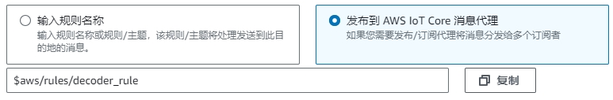
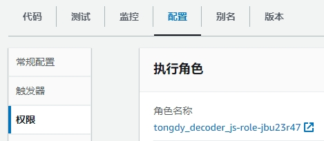
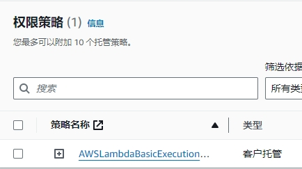
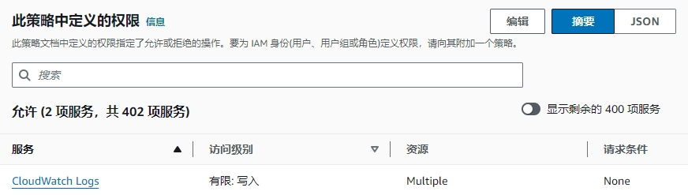

# AWS IoT Core 接收 Lora 数据并转发到 MQTT 指南

**本指南中需要把地址中的 `us-east-1` 替换为你的区域，如 `cn-northwest-1`**

## 目的地

1. 打开 [目的地](https://us-east-1.console.aws.amazon.com/iot/home?region=us-east-1#/wireless/destinations)
   `https://us-east-1.console.aws.amazon.com/iot/home?region=us-east-1#/wireless/destinations`
2. 选择 `添加目标`
3. 选择 `发布到 AWS IoT Core 消息代理` ，并填写 `Topic` ，例：`project/sensor/decoded`

   

4. 选择 `添加目标` 完成目的地的创建

## 生成外部可连接的 MQTT Topic 设置

1. 打开 [策略](https://us-east-1.console.aws.amazon.com/iot/home?region=us-east-1#/policyhub)
   `https://us-east-1.console.aws.amazon.com/iot/home?region=us-east-1#/policyhub`
2. 点击 `创建策略`
3. 将 **[topic-policy.json](topic-policy.json)** 中的 `<YOUR_TOPIC>` 替换为你的 `Topic` ，例：`/aws/lora`
4. 将修改后的内容输入到 `策略文档` 中
5. 点击 `创建策略` 完成策略的创建

### 生成证书

#### 创建证书

1. 确保系统中已经安装 `openssl` 。
2. 在 `终端`/`命令提示符` 中运行命令:

```bash
# 创建私钥（2048 位 RSA 加密算法）文件 client.key :
openssl genrsa -out client.key 2048
# 根据 client.key 创建证书签名请求文件 client.csr :
openssl req -new -key client.key -out client.csr
# 可选: 也可以选择更新的椭圆加密 (256 位 ECC 加密算法) 创建私钥，但部分程序不支持:
openssl ecparam -genkey -name secp384r1 -out client.key 256
openssl req -new -sha384 -key client.key -out client.csr
```

3. 接下来会被询问一些问题，`Common Name` 填写 `AWS IoT Certificate`，其他保持默认值即可，也可按下面的内容填写：

```txt
Country Name (2 letter code) [AU]: US
State or Province Name (full name) [Some-State]: Washingto
Locality Name (eg, city) []: Seattle
Organization Name (eg, company) [Internet Widgits Pty Ltd]: Amazon.com Inc.
Organizational Unit Name (eg, section) []: Amazon Web Services
Common Name (e.g. server FQDN or YOUR name) []: AWS IoT Certificate
Email Address []:

Please enter the following 'extra' attributes
to be sent with your certificate request
A challenge password []:
An optional company name []:
```

4. 将会看到当前文件夹具有以下文件:

- `client.key`: 私钥文件
- `client.csr`: 证书签名请求文件

#### 上传和签发证书

1. 打开 [证书](https://us-east-1.console.aws.amazon.com/iot/home?region=us-east-1#/certificatehub)
   `https://us-east-1.console.aws.amazon.com/iot/home?region=us-east-1#/certificatehub`
2. 点击 `添加证书` 中的 `创建证书`
3. 选择 `使用证书签名请求 (CSR) 创建证书`
4. 点击 `选择文件`, 上传你的证书签名请求文件( .csr )。例如 `client.csr`
5. 在 `证书状态` 选择 `活跃`，并按 `创建` 按钮
6. 点第一个 `下载` 按钮，下载你的设备证书 ( .pem.crt )
7. 根据 **创建私钥时使用的加密算法**，从 `RSA 2048 位密钥` 或 `ECC 256 位密钥` 中选择其一进行下载
8. 此时，当前文件夹应该具有以下文件:

- `client.key`: 私钥文件 (在 MQTT 客户端中使用)
- `client.csr`: 证书签名请求文件
- `*-certificate.pem.crt`: 证书文件 (在 MQTT 客户端中使用)
- `AmazonRootCA*.pem`: CA 证书文件 (在 MQTT 客户端中使用)

9. 点击 `继续` 按钮

#### 为证书添加策略

1. 在页面上面会有绿色底色的提示框 `您已成功创建证书 ...` ，点击里面的 `查看证书` 按钮（如果没有，点击下方刚刚创建的证书 ID），将能够看到证书的 ID、有效日期 等信息
2. 在下方 `策略` 处点击 `附加策略` 按钮
3. 在 `选择 AWS IoT 策略` 选择框中，选择之前记下的 `[Thing name]-Policy`，并点击 `附加策略`。

## 函数

### 创建函数

1. 打开 [函数](https://us-east-1.console.aws.amazon.com/lambda/home?region=us-east-1#/functions)
   `https://us-east-1.console.aws.amazon.com/lambda/home?region=us-east-1#/functions`
2. 选择 `创建函数`
3. 选择 `从头开始创建`
4. 填写函数名称，运行时选择`Node.js 14.x`，选择 `创建函数`
5. 将 **[index.js](index.js)** 中的内容输入到新建的函数中。可以根据代码中的注释进行自定义，例如配置 `topic` 需修改为 [生成外部可连接的 MQTT 设置](#生成外部可连接的-mqtt-topic-设置) 中修改的 `Topic`。
6. 选择 `Deploy` 完成函数的创建。

### 设置函数权限

1. 选择 `配置` -> `权限` -> `角色名称`

   

2. 点击角色名称，进入角色页面
3. 点击 `策略名称` ，进入策略页面

   

4. 点击 `此策略中定义的权限` 部分中的 `编辑` 按钮

   

5. 在 `Statement` 中添加以下代码

```json
{
  "Effect": "Allow",
  "Action": "iot:Publish",
  "Resource": "*"
}
```

- **[完整json文件](lambda-policy.json)**

此时的完整内容应该类似于 **[lambda-policy.json](lambda-policy.json)** 。

6. 点击 `下一步` ，点击 `保存更改` 完成函数权限的设置

### 设置函数触发器

1. 回到函数页面，点击 `配置` -> `触发器` -> `添加触发器`
2. 在 `选择一个源` 中，选择 `AWS IoT`
3. 选择 `Custom IoT rule`
4. 在 `Rule` 中，选择 `Create a new rule`
5. 在 `Rule name` 中填写规则名称，例：`decoder_js_rule`
6. 在 `Rule query statement` 中填写`SQL语句`，例：

```sql
SELECT * FROM 'project/sensor/decoded'
```

7. 点击 `添加` 完成触发器的创建
