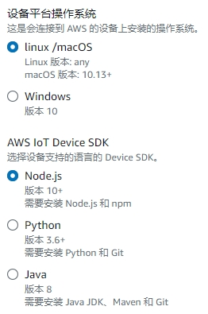
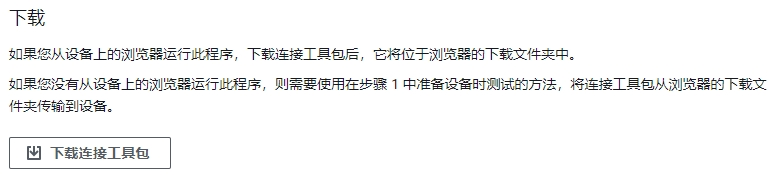

### 本指南中需要把地址中的`us-east-1`替换为你的区域，如`cn-northwest-1`

# 目的地

1. 打开[目的地](https://us-east-1.console.aws.amazon.com/iot/home?region=us-east-1#/wireless/destinations)
`https://us-east-1.console.aws.amazon.com/iot/home?region=us-east-1#/wireless/destinations`
2. 选择“添加目标”
3. 选择“发布到 AWS IoT Core 消息代理”，并填写`Topic`，例：`project/sensor/decoded`

   
4. 选择“添加目标”完成目的地的创建

# 生成外部可连接的MQTT设置
1. 打开[连接一台设备](https://us-east-1.console.aws.amazon.com/iot/home?region=us-east-1#/connectdevice)
`https://us-east-1.console.aws.amazon.com/iot/home?region=us-east-1#/connectdevice`
2. 跟随步骤操作，到 步骤3 选择操作系统及语言
    
    
3. 选择“下一步”到 步骤4 点击`下载连接工具包`

    
4. 解压下载的工具包，打开`start.sh`
    - 找到`--endpoint`参数，其后的值为 MQTT 服务器地址，例：
    ```
    aq275if561cb4-ats.iot.us-east-1.amazonaws.com
    ```
    - 找到`--client_id`参数，其后的值为 MQTT 客户端ID，例：
    ```
    sdk-nodejs-v2
    ```
    - 找到`--topic`参数，其后的值为 MQTT Topic，例：
    ```
    sdk/test/js
    ```
5. 此时可以关闭[连接一台设备]页面
6. 生成证书


# 函数
## 创建函数
1. 打开[函数](https://us-east-1.console.aws.amazon.com/lambda/home?region=us-east-1#/functions)
`https://us-east-1.console.aws.amazon.com/lambda/home?region=us-east-1#/functions`
2. 选择“创建函数”
3. 选择“从头开始创建”
4. 填写函数名称，运行时选择`Node.js 14.x`，选择“创建函数”
```JavaScript
const AWS = require('aws-sdk');

exports.handler = async (event) => {
  var data = Buffer.from(event.PayloadData, 'base64');
  var chars = [...data];
  var params = Decoder(chars, event.WirelessMetadata.LoRaWAN.FPort);
  params["EUI"]= event.WirelessMetadata.LoRaWAN.DevEui;
  var iotdata = new AWS.IotData({ endpoint: 'aq275if561cb4-ats.iot.us-east-1.amazonaws.com' });
  var response = {
    topic: "sdk/test/js",// 此处填写你的Topic
    payload: JSON.stringify(params),
    qos: 0
  };

  console.log(response);

  return new Promise((resolve, reject) => {
    iotdata.publish(response, (err, data) => {
      if (err) {
        console.log('=== Error ===');
        console.log("ERROR => " + JSON.stringify(err));
        
        const returnData = {
          statusCode: 400,
          body: JSON.stringify(err),
        };
        reject(returnData);
      }
      else {
        console.log('=== Publish ===');
        console.log("publish data: ", response);

        const returnData = {
          statusCode: 200,
          body: JSON.stringify(params),
        };
        resolve(returnData);
      }
    });
  });
};


// For TTN, Helium and Datacake
function Decoder(bytes, fport) {

  // flat output (like original decoder):
  var response = {};
  lppDecode(bytes, 1).forEach(function (field) {
    response[field['name'] + '_' + field['channel']] = field['value'];
  });

  return response;
}


// PASTE DECODER HERE
function lppDecode(bytes) {
  var sensor_types = {
    0: { 'size': 1, 'name': 'digital_in', 'signed': false, 'divisor': 1 },
    1: { 'size': 1, 'name': 'digital_out', 'signed': false, 'divisor': 1 },
    2: { 'size': 2, 'name': 'analog_in', 'signed': true, 'divisor': 100 },
    3: { 'size': 2, 'name': 'analog_out', 'signed': true, 'divisor': 100 },
    100: { 'size': 4, 'name': 'generic', 'signed': false, 'divisor': 1 },
    101: { 'size': 2, 'name': 'illuminance', 'signed': false, 'divisor': 1 },  //unit:Lux
    102: { 'size': 1, 'name': 'presence', 'signed': false, 'divisor': 1 },
    103: { 'size': 2, 'name': 'temperature', 'signed': true, 'divisor': 10 },  //unit:℃
    104: { 'size': 1, 'name': 'humidity', 'signed': false, 'divisor': 2 },
    112: { 'size': 2, 'name': 'humidity_prec', 'signed': true, 'divisor': 10 },  //unit:%RH
    113: { 'size': 6, 'name': 'accelerometer', 'signed': true, 'divisor': 1000 },
    115: { 'size': 2, 'name': 'barometer', 'signed': false, 'divisor': 10 },  //unit:hPa
    116: { 'size': 2, 'name': 'voltage', 'signed': false, 'divisor': 100 },
    117: { 'size': 2, 'name': 'current', 'signed': false, 'divisor': 1000 },
    118: { 'size': 4, 'name': 'frequency', 'signed': false, 'divisor': 1 },
    120: { 'size': 1, 'name': 'percentage', 'signed': false, 'divisor': 1 },
    121: { 'size': 2, 'name': 'altitude', 'signed': true, 'divisor': 1 },
    125: { 'size': 2, 'name': 'concentration', 'signed': false, 'divisor': 1 },
    128: { 'size': 2, 'name': 'power', 'signed': false, 'divisor': 1 },
    130: { 'size': 4, 'name': 'distance', 'signed': false, 'divisor': 1000 },
    131: { 'size': 4, 'name': 'energy', 'signed': false, 'divisor': 1000 },
    132: { 'size': 2, 'name': 'direction', 'signed': false, 'divisor': 1 },
    133: { 'size': 4, 'name': 'time', 'signed': false, 'divisor': 1 },
    134: { 'size': 6, 'name': 'gyrometer', 'signed': true, 'divisor': 100 },
    135: { 'size': 3, 'name': 'colour', 'signed': false, 'divisor': 1 },
    136: { 'size': 9, 'name': 'gps', 'signed': true, 'divisor': [10000, 10000, 100] },
    137: { 'size': 11, 'name': 'gps', 'signed': true, 'divisor': [1000000, 1000000, 100] },
    138: { 'size': 2, 'name': 'voc', 'signed': false, 'divisor': 1 },
    142: { 'size': 1, 'name': 'switch', 'signed': false, 'divisor': 1 },
    188: { 'size': 2, 'name': 'soil_moist', 'signed': false, 'divisor': 10 },
    190: { 'size': 2, 'name': 'wind_speed', 'signed': false, 'divisor': 100 },  //unit:m/s
    191: { 'size': 2, 'name': 'wind_direction', 'signed': false, 'divisor': 1 },  //unit:°
    192: { 'size': 2, 'name': 'soil_ec', 'signed': false, 'divisor': 1000 },
    193: { 'size': 2, 'name': 'soil_ph_h', 'signed': false, 'divisor': 100 },
    194: { 'size': 2, 'name': 'soil_ph_l', 'signed': false, 'divisor': 10 },
    195: { 'size': 2, 'name': 'pyranometer', 'signed': false, 'divisor': 1 },
    203: { 'size': 1, 'name': 'light', 'signed': false, 'divisor': 1 },

    //Tongdy 20230805 		
    211: { 'size': 2, 'name': 'co2', 'signed': true, 'divisor': 1 },  //unit:ppm
    212: { 'size': 2, 'name': 'tvoc', 'signed': true, 'divisor': 1000 },  //unit:mg/m3
    213: { 'size': 2, 'name': 'pm0.3', 'signed': true, 'divisor': 1 },  //unit:ug/m3
    214: { 'size': 2, 'name': 'pm0.5', 'signed': true, 'divisor': 1 },  //unit:ug/m3
    215: { 'size': 2, 'name': 'pm1', 'signed': true, 'divisor': 1 },  //unit:ug/m3
    216: { 'size': 2, 'name': 'pm2.5', 'signed': true, 'divisor': 1 },  //unit:ug/m3
    217: { 'size': 2, 'name': 'pm4', 'signed': true, 'divisor': 1 },  //unit:ug/m3
    218: { 'size': 2, 'name': 'pm10', 'signed': true, 'divisor': 1 },  //unit:ug/m3
    219: { 'size': 2, 'name': 'pm100', 'signed': true, 'divisor': 1 },  //unit:ug/m3
    220: { 'size': 2, 'name': 'co', 'signed': true, 'divisor': 10 },  //unit:mg/m3
    221: { 'size': 2, 'name': 'o3', 'signed': true, 'divisor': 1 },  //unit:ug/m3
    222: { 'size': 2, 'name': 'so2', 'signed': true, 'divisor': 1 },  //unit:ug/m3
    223: { 'size': 2, 'name': 'no2', 'signed': true, 'divisor': 1 },  //unit:ug/m3
    224: { 'size': 2, 'name': 'hcho', 'signed': true, 'divisor': 1000 },  //unit:mg/m3			
    225: { 'size': 2, 'name': 'noise', 'signed': true, 'divisor': 10 },  //unit:dB(A)
  };

  function arrayToDecimal(stream, is_signed, divisor) {

    var value = 0;
    for (var i = 0; i < stream.length; i++) {
      if (stream[i] > 0xFF)
        throw 'Byte value overflow!';
      value = (value << 8) | stream[i];
    }

    if (is_signed) {
      var edge = 1 << (stream.length) * 8;  // 0x1000..
      var max = (edge - 1) >> 1;             // 0x0FFF.. >> 1
      value = (value > max) ? value - edge : value;
    }

    value /= divisor;

    return value;

  }

  var sensors = [];
  var i = 0;
  while (i < bytes.length) {

    var s_no = bytes[i++];
    var s_type = bytes[i++];
    if (typeof sensor_types[s_type] == 'undefined') {
      throw 'Sensor type error!: ' + s_type;
    }

    var s_value = 0;
    var type = sensor_types[s_type];
    switch (s_type) {

      case 113:   // Accelerometer
      case 134:   // Gyrometer
        s_value = {
          'x': arrayToDecimal(bytes.slice(i + 0, i + 2), type.signed, type.divisor),
          'y': arrayToDecimal(bytes.slice(i + 2, i + 4), type.signed, type.divisor),
          'z': arrayToDecimal(bytes.slice(i + 4, i + 6), type.signed, type.divisor)
        };
        break;
      case 136:   // GPS Location
        s_value = {
          'latitude': arrayToDecimal(bytes.slice(i + 0, i + 3), type.signed, type.divisor[0]),
          'longitude': arrayToDecimal(bytes.slice(i + 3, i + 6), type.signed, type.divisor[1]),
          'altitude': arrayToDecimal(bytes.slice(i + 6, i + 9), type.signed, type.divisor[2])
        };
        break;
      case 137:   // Precise GPS Location
        s_value = {
          'latitude': arrayToDecimal(bytes.slice(i + 0, i + 4), type.signed, type.divisor[0]),
          'longitude': arrayToDecimal(bytes.slice(i + 4, i + 8), type.signed, type.divisor[1]),
          'altitude': arrayToDecimal(bytes.slice(i + 8, i + 11), type.signed, type.divisor[2])
        };
        sensors.push({
          'channel': s_no,
          'type': s_type,
          'name': 'location',
          'value': "(" + s_value.latitude + "," + s_value.longitude + ")"
        });
        sensors.push({
          'channel': s_no,
          'type': s_type,
          'name': 'altitude',
          'value': s_value.altitude
        });
        break;
      case 135:   // Colour
        s_value = {
          'r': arrayToDecimal(bytes.slice(i + 0, i + 1), type.signed, type.divisor),
          'g': arrayToDecimal(bytes.slice(i + 1, i + 2), type.signed, type.divisor),
          'b': arrayToDecimal(bytes.slice(i + 2, i + 3), type.signed, type.divisor)
        };
        break;

      default:    // All the rest
        s_value = arrayToDecimal(bytes.slice(i, i + type.size), type.signed, type.divisor);
        break;
    }

    sensors.push({
      'channel': s_no,
      'type': s_type,
      'name': type.name,
      'value': s_value
    });

    i += type.size;

  }

  return sensors;

}
```
5. 选择“Deploy”完成函数的创建

## 设置函数权限
1. 选择“配置”->“权限”->“角色名称”

    
2. 点击角色名称，进入角色页面
3. 点击“策略名称”，进入策略页面

    
4. 点击“此策略中定义的权限”部分中的“编辑”按钮

    
5. 在`Statement`中添加以下代码
```
{
    "Effect": "Allow",
    "Action": "iot:Publish",
    "Resource": "*"
}
```
全文如下：
```
{
	"Version": "2012-10-17",
	"Statement": [
		{
			"Effect": "Allow",
			"Action": "logs:CreateLogGroup",
			"Resource": "arn:aws:logs:us-east-1:988387762277:*"
		},
		{
			"Effect": "Allow",
			"Action": [
				"logs:CreateLogStream",
				"logs:PutLogEvents"
			],
			"Resource": [
				"arn:aws:logs:us-east-1:988387762277:log-group:/aws/lambda/tongdy_decoder_js:*"
			]
		},
		{
			"Effect": "Allow",
			"Action": "iot:Publish",
			"Resource": "*"
		}
	]
}
```
11. 点击“下一步”，点击“保存更改”完成函数权限的设置

## 设置函数触发器
1. 回到函数页面，点击“配置”->“触发器”->“添加触发器”
2. 在“选择一个源”中，选择“AWS IoT”
3. 选择“Custom IoT rule”
4. 在“Rule”中，选择“Create a new rule”
5. 在“Rule name”中填写规则名称，例：`decoder_js_rule`
6. 在“Rule query statement”中填写`SQL语句`，例：
```
SELECT * FROM 'project/sensor/decoded'
```
7. 点击“添加”完成触发器的创建
